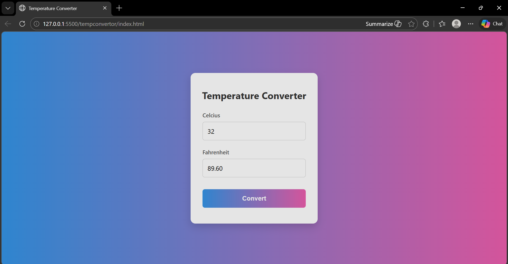

# 🌡️ Temperature Converter

A clean, beautiful, and responsive web application to seamlessly convert temperatures between Celsius and Fahrenheit.



## ✨ Features

- **Bidirectional Conversion**: Convert Celsius to Fahrenheit and vice versa.
- **Real-Time Calculation**: See conversions instantly as you type!
- **Modern UI**: Designed with a sleek, glassmorphic card layout and beautiful gradient backgrounds.
- **Responsive**: Perfectly structured using CSS Flexbox, ensuring it looks great on any screen size.
- **No Dependencies**: Built entirely with Vanilla JavaScript—no external libraries needed!

## 🚀 Technologies Used

- **HTML5**: Semantic and accessible page structure.
- **CSS3**: Modern layout techniques (Flexbox), gradients, and interactive hover states.
- **JavaScript (ES6)**: Clean, human-readable logic for dynamic DOM manipulation and mathematical conversion.

## 💻 How to Use Locally

1. Clone this repository:
   ```bash
   git clone https://github.com/harshyadav-25/temperature-converter.git
   ```
2. Navigate to the project directory:
   ```bash
   cd temperature-converter
   ```
3. Open `index.html` in your favorite web browser!

---
*Coded with ❤️ by Harsh Yadav*
